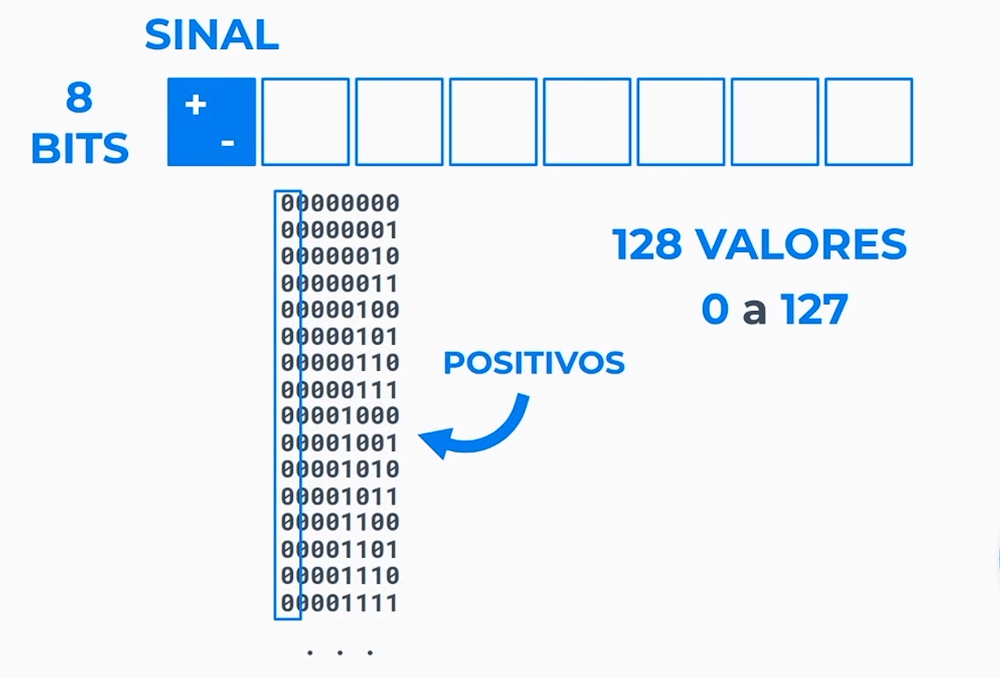
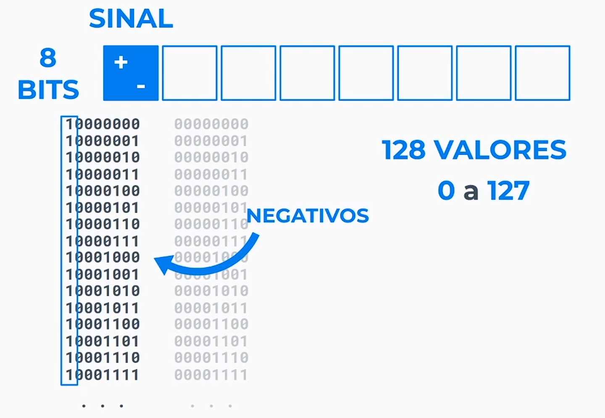

1 bit armazena o valor 1 ou 0 que significa ligado ou desligado, que são 2 valores, caso seja 2 bits, será armazenado 4 valores e assim por diante, caso queira representar um número negativo ou positivo, será usado 1 bit no inicio do valor.

