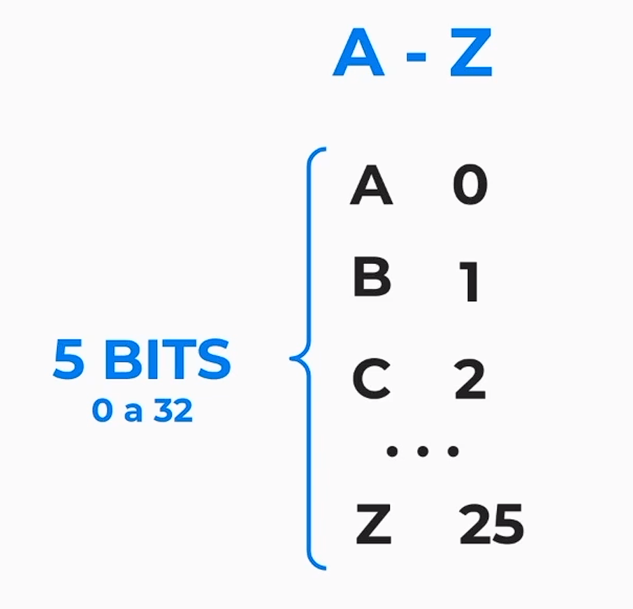
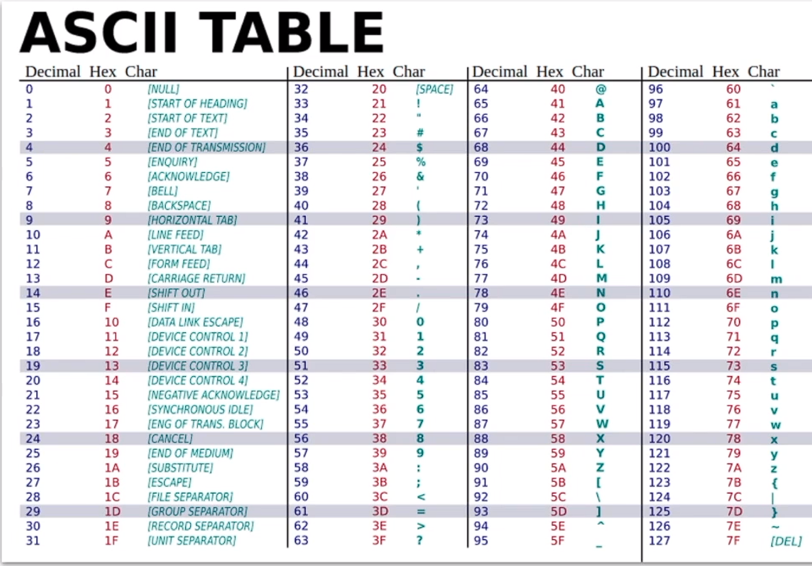
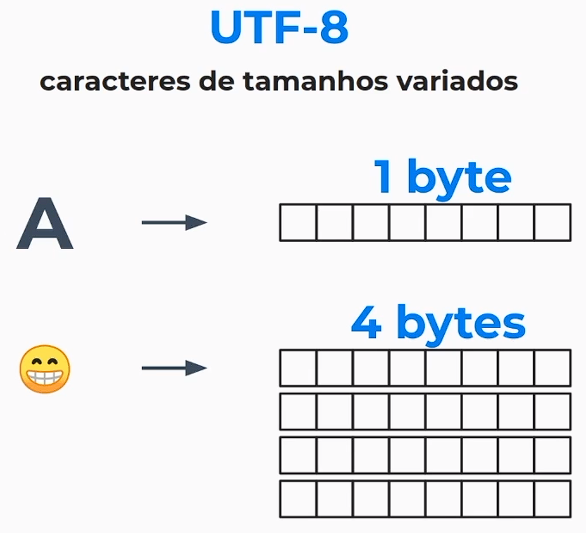

Para diferenciar as letras *MAIÚSCULAS* de *minúsculas* foi criado a **TABELA ASCII**.

Depois de algum tempo surgiu o **latin1**, que continha caracteres acentuado, acrescentando assim mais símbolos.

Existia um problema, o mundo é composto por vários povos com linguas diferentes e povos diferentes, e os computadores usados por esses povos tinham computadores com seus próprios caracteres, assim caso uma lingua enviasse um texto para uma outra lingua, os 2 não iriam se comunicar, e para isso surgiu o **UNICODE**, que engloba todos os caracteres existentes para a comunicação global.

O padrão **UTF-8** foi usado para representar a Tabela **ASCII** e os caracteres que possuiam 1 byte, e qualquer caractere além dos incluidos na tabela incluiria sempre mais de 1 byte, assim ele é usado para representar caracteres de tamanhos variados.

