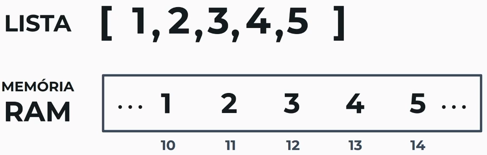

Para se representar uma lista, é alocada na memória RAM espaços contíguos para cada um dos valores, um do lado do outro, as vantagens são a eficiencia com cache, e facilidade de encontrar os valores.

Caso se tenha várias listas em uma memória RAM, e de tamanhos variados, a solução é guardar o valor do endereço de cada uma das listas.

Um **Ponteiro** é uma referência que aponta para um endereço na memória.